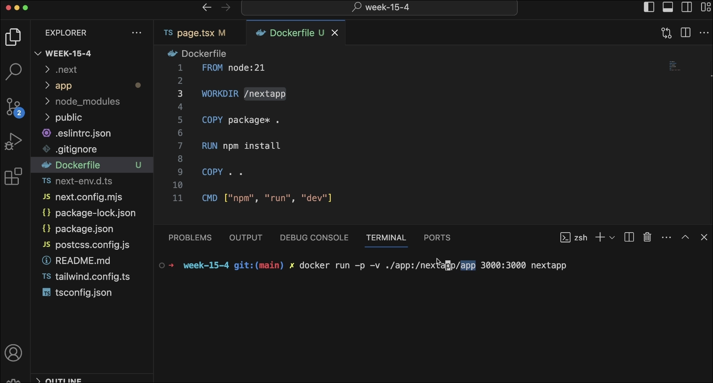

# Bindmounts
---
## We use bind mounts to link the local folders to docker container 

- when we are developing locally once we build the image and make changes in local code the image will not update as the image is running it will show the code at the time it is last built 
- it is ame as volumes 



```bash 
docker run -v ./app:/nextapp/app -p 3000:3000 nextapp
```
- as `/nextapp` is the base image 
- it binds the `./app` folder to `/nextapp/app` inside the container 
