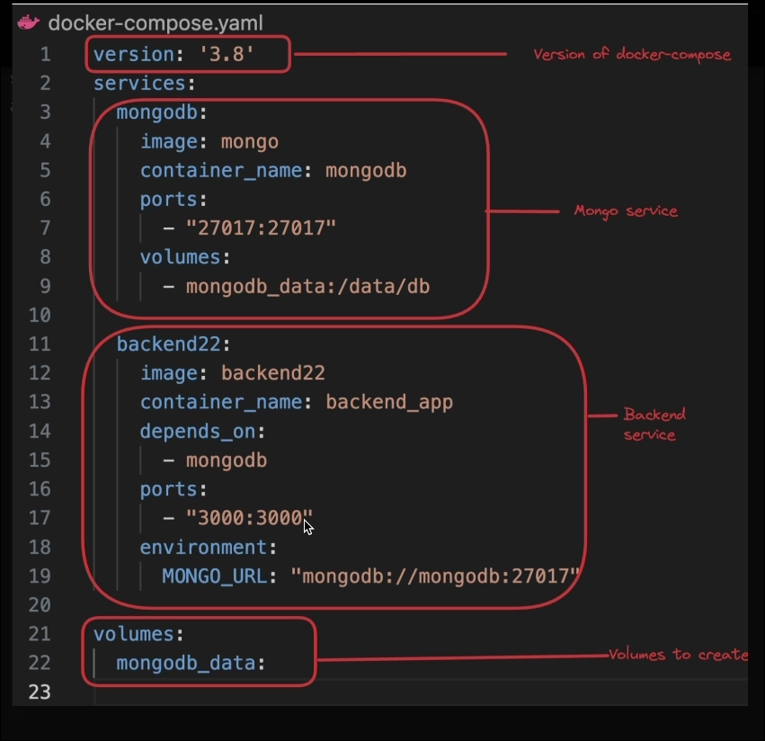

# Docker Compose
- Docker compose is used to define and  run multi container Docker application 
- In Docker compose we Use a yaml file to confihure our Application's `Service` , `Networks` , `volumes`
- It used to connect all of them in a single file 




## To Run :
```bash
docker-compose up

```
> `Note :` Need to install `docker-compose`